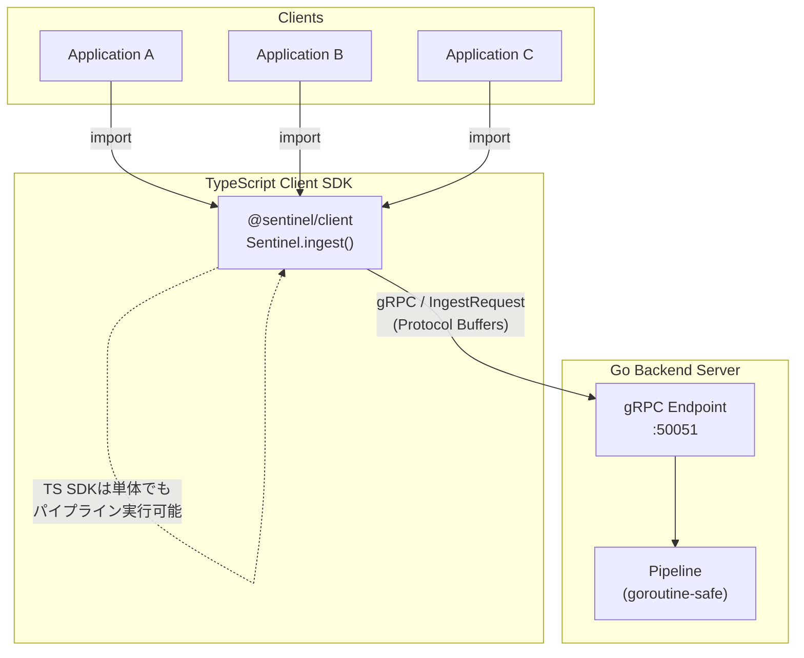
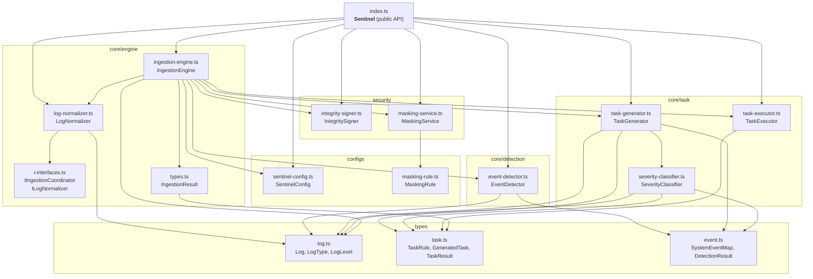
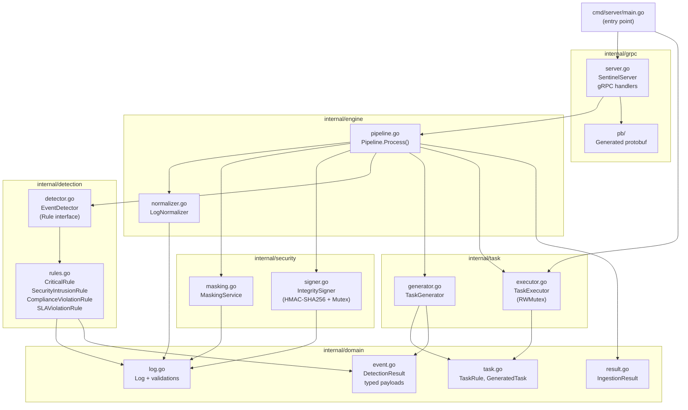
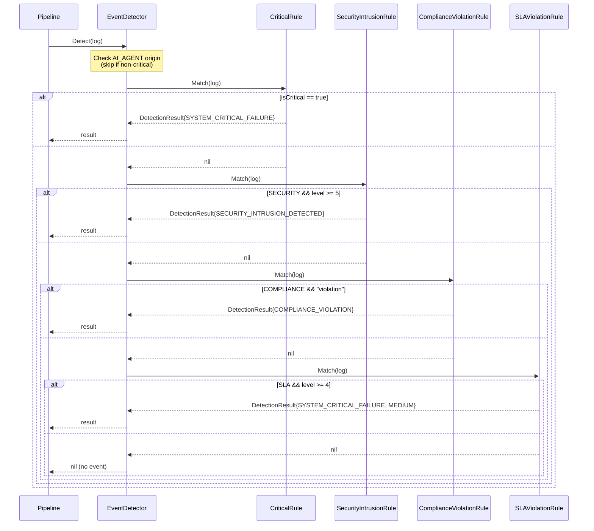
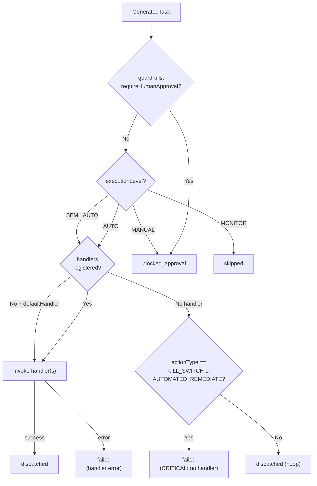
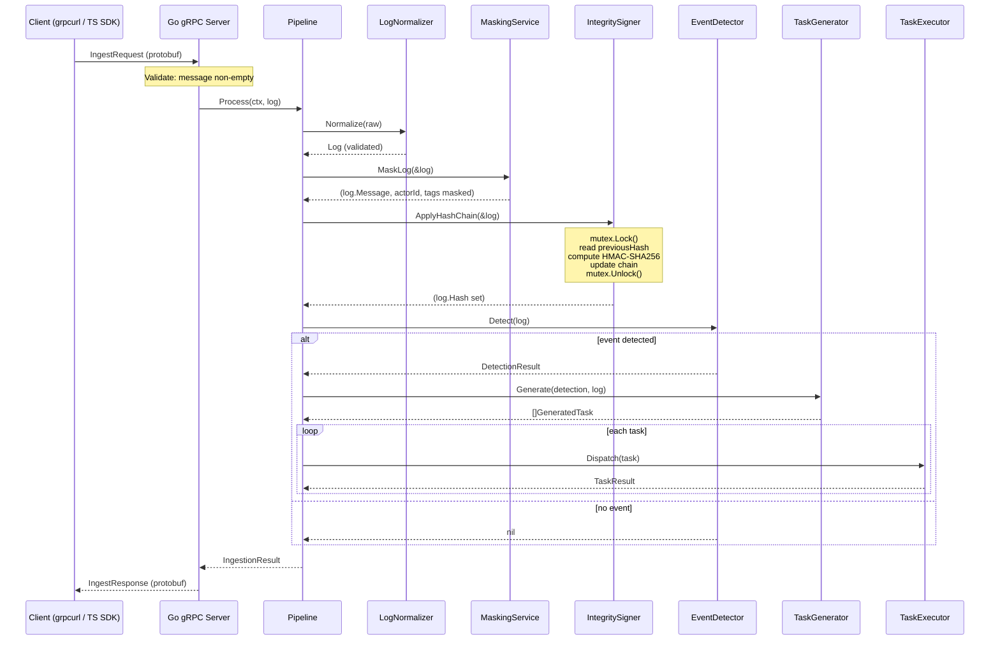
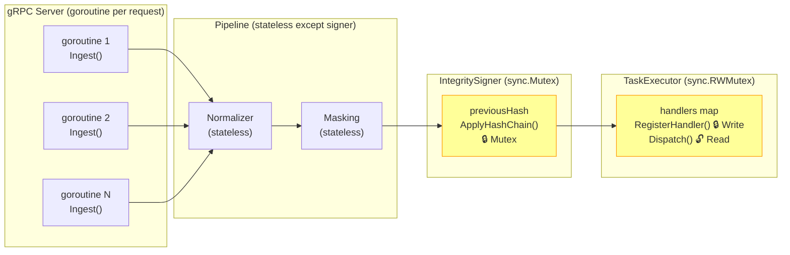

# Sentinel Architecture Diagrams

## 1. System Overview (High Level)

---

## 2. Pipeline Processing Flow

```mermaid
flowchart TD
    INPUT["Partial&lt;Log&gt;<br/>message, type, level, ..."]

    subgraph "Stage 1: Normalize"
        N1["Validate message<br/>(empty, length, UTF-8, null bytes)"]
        N2["Generate traceId<br/>(UUID v4 if missing)"]
        N3["Apply defaults<br/>(type→SYSTEM, level→3, origin→SYSTEM)"]
        N4["Remove control characters<br/>(keep tab/newline)"]
    end

    subgraph "Stage 2: Mask PII"
        M1["REGEX rules<br/>(custom patterns)"]
        M2["PII_TYPE detection<br/>(EMAIL, CREDIT_CARD,<br/>PHONE, GOVERNMENT_ID)"]
        M3["KEY_MATCH<br/>(sensitive object keys)"]
        M4["Mask fields:<br/>message, actorId,<br/>tags[].category"]
    end

    subgraph "Stage 3: Hash Chain"
        H1["Read previousHash<br/>(mutex-locked)"]
        H2["Deterministic serialize<br/>(keys sorted, hash/sig excluded)"]
        H3["HMAC-SHA256<br/>(server secret key)"]
        H4["Update chain state<br/>(mutex-locked)"]
    end

    subgraph "Stage 4: Detect Events"
        D0{"AI_AGENT origin?<br/>(non-critical)"}
        D1["CriticalRule<br/>isCritical == true"]
        D2["SecurityIntrusionRule<br/>SECURITY && level >= 5"]
        D3["ComplianceViolationRule<br/>COMPLIANCE && 'violation'"]
        D4["SLAViolationRule<br/>SLA && level >= 4"]
    end

    subgraph "Stage 5: Generate Tasks"
        T1["Event name → Rule index lookup"]
        T2["Classify severity<br/>(event + log context)"]
        T3["Filter: actual >= rule threshold"]
        T4["Sort by priority (ascending)"]
        T5["Create GeneratedTask[]"]
    end

    subgraph "Stage 6: Dispatch"
        E1{"requireHumanApproval?"}
        E2{"executionLevel?"}
        E3["Invoke registered handlers"]
        E4["Return TaskResult"]
    end

    OUTPUT["IngestionResult<br/>traceId, hashChainValid,<br/>masked, tasksGenerated[]"]

    INPUT --> N1 --> N2 --> N3 --> N4
    N4 --> M1 --> M2 --> M3 --> M4
    M4 --> H1 --> H2 --> H3 --> H4
    H4 --> D0
    D0 -->|Yes| OUTPUT
    D0 -->|No| D1
    D1 -->|miss| D2
    D2 -->|miss| D3
    D3 -->|miss| D4
    D4 -->|miss| OUTPUT
    D1 -->|hit| T1
    D2 -->|hit| T1
    D3 -->|hit| T1
    D4 -->|hit| T1
    T1 --> T2 --> T3 --> T4 --> T5
    T5 --> E1
    E1 -->|Yes| E4
    E1 -->|No| E2
    E2 -->|AUTO / SEMI_AUTO| E3
    E2 -->|MANUAL| E4
    E2 -->|MONITOR| E4
    E3 --> E4
    E4 --> OUTPUT
```

---

## 3. TypeScript SDK - Module Dependency Graph

---

## 4. Go Server - Package Dependency Graph

---

## 5. Event Detection Rule Chain (Strategy Pattern)

---

## 6. Task Dispatch Decision Flow

---

## 7. gRPC Communication Sequence

---

## 8. Concurrency Model

